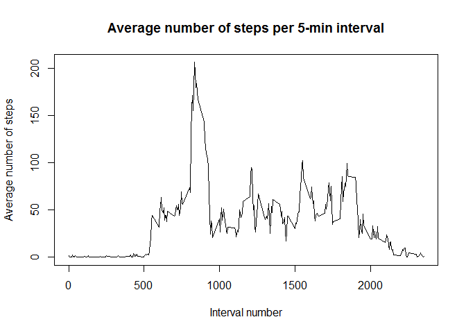
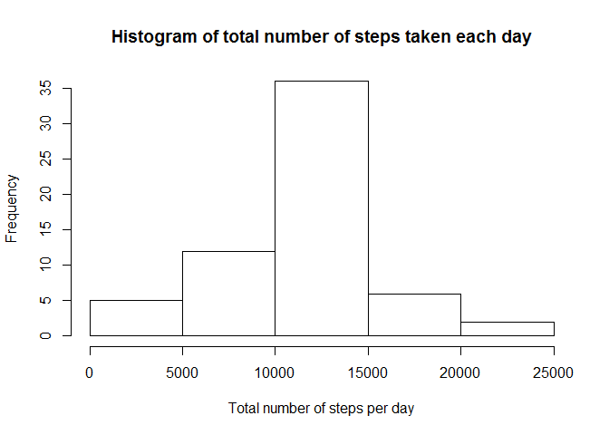
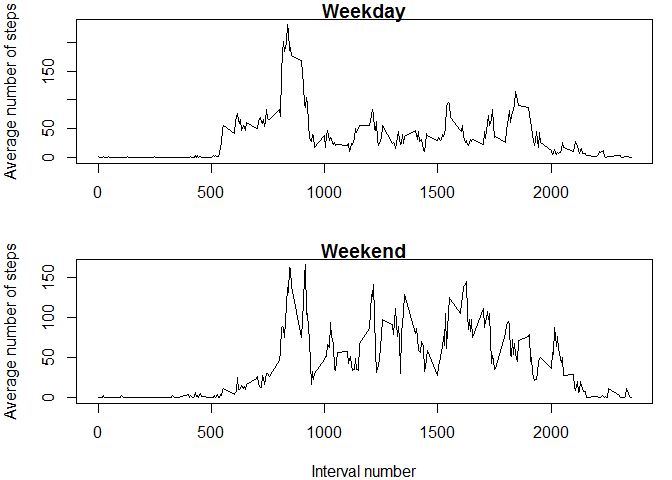

# Reproducible Research: Peer Assessment 1
Anh Bui  


## Loading and preprocessing the data

Unzip and read in data file:

```r
unzip("activity.zip")
dat <- read.csv("activity.csv")
```
Get the names of the columns

```r
names(dat)
```

```
## [1] "steps"    "date"     "interval"
```

Swap the columns of the dataframe:

```r
dat <- dat[,c("date","interval","steps")]
```

## What is mean total number of steps taken per day?

Calculate the total number of steps taken for all the days

```r
totalSteps <- tapply(dat$steps, dat$date, sum, na.rm = TRUE)
```

The mean of total number of steps taken per day

```r
mean(totalSteps)
```

```
## [1] 9354.23
```
and the median of steps taken per day 

```r
median(totalSteps)
```

```
## [1] 10395
```

Produce a histogram of the total number of steps taken each day

```r
hist(totalSteps,xlab="Total number of steps per day",main="Histogram of total number of steps taken each day")
```

<!-- -->

## What is the average daily activity pattern?

Calculate the numbers of steps taken per 5-minute interval averaged across all days

```r
aveSteps <- tapply(dat$steps, dat$interval, mean, na.rm = TRUE)
```

Convert the array into a dataframe

```r
aveSteps <- data.frame(interval=as.numeric(names(aveSteps)),aveSteps)
```

Plot the numbers of steps taken per 5-minute interval averaged across all days

```r
plot(aveSteps$interval,aveSteps$aveSteps,type="l",main="Average number of steps per 5-min interval",xlab="Interval number",ylab="Average number of steps")
```

<!-- -->

The interval with maximum number of steps averaged across all days

```r
sortedAveSteps <- aveSteps[order(aveSteps$aveSteps,decreasing = TRUE),]
sortedAveSteps$interval[1]
```

```
## [1] 835
```

## Imputing missing values

Total number of missing values in the dataset (i.e. the total number of rows with NAs)

```r
sum(is.na(dat$steps))
```

```
## [1] 2304
```

Strategy for filling the missing values in the dataset: **Replacing the missing values with the mean values of steps per 5-min interval obtained with the "na.rm" option set to TRUE**

Create a new dataframe with missising values filled

```r
impDat <- subset(dat,FALSE)
for(i in 1:length(levels(dat$date))) {
  adat <- dat[dat$date==levels(dat$date)[i],]
  adat <- transform(adat,steps=ifelse(is.na(steps),aveSteps$aveSteps,steps))
  impDat <- rbind(impDat,adat)
}
```

Calculate the total number of steps taken for all the days

```r
totalSteps <- tapply(impDat$steps, impDat$date, sum)
```

Produce a histogram of the total number of steps taken each day

```r
hist(totalSteps,xlab="Total number of steps per day",main="Histogram of total number of steps taken each day")
```

<!-- -->
The mean of total number of steps taken per day

```r
mean(totalSteps)
```

```
## [1] 10766.19
```
and the median of steps taken per day 

```r
median(totalSteps)
```

```
## [1] 10766.19
```

The new mean and median values are equal, but are different from the mean and median previously obtained for the dataset with missing values simply ignored.

## Are there differences in activity patterns between weekdays and weekends?

Create a new column showing the week day

```r
impDat["weekday"] <- weekdays(as.Date(impDat$date))
```

Create a vector of weekend days

```r
weekend <- c("Saturday","Sunday")
```

Add a factor to the dataframe showing week or weekend days 

```r
impDat["wDay"] <- factor((impDat$weekday %in% weekend),levels=c(FALSE,TRUE),labels=c("weekday","weekend"))
```

Calculate the numbers of steps taken per 5-minute interval averaged across week days or weekends

```r
lists <- list(wDay=impDat$wDay,interval=impDat$interval)
aveWDSteps <- tapply(impDat$steps,lists,mean)
```

Convert the matrix into weekday and weekend dataframes

```r
weekday <- data.frame(interval=as.numeric(colnames(aveWDSteps)),avesteps=aveWDSteps[1,])
weekend <- data.frame(interval=as.numeric(colnames(aveWDSteps)),avesteps=aveWDSteps[2,])
```

Make a panel plot containing a time series plot (i.e. type = "l") of the 5-minute interval (x-axis) and the average number of steps taken, averaged across all weekday days or weekend days (y-axis)

```r
par(mfrow=c(2,1),mar = c(4, 4, 1, 1))
plot(weekday$interval,weekday$avesteps,type="l",main="Weekday",xlab="",ylab="Average number of steps")
plot(weekend$interval,weekend$avesteps,type="l",main="Weekend",xlab="Interval number",ylab="Average number of steps")
```

<!-- -->
